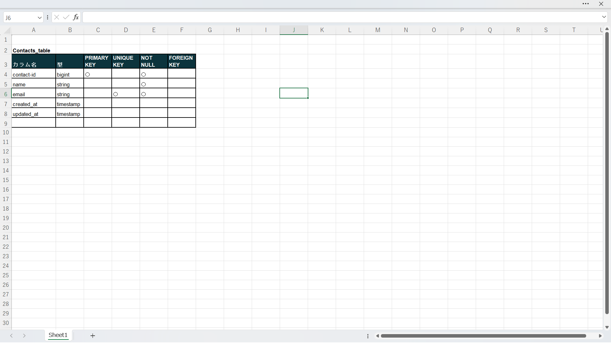

# laravel-docker-template

## アプリケーション名
address-test

### 概要説明

## 作成した目的
 ツイッター風SNSアプリ作成前に、どのようにLaravelとNuxt.jsを実装するのか確認するため。

## 機能一覧
- 連絡先の取得
- 連絡先の追加
- 連絡先の更新
- 連絡先の削除

## 使用技術（実行環境）
- Laravel : 8.83.8
- Docker : 27.2.0
- PHP : 8.1.34
- nginx:1.21.1
- mysql:8.0.26
- Nuxt :4.2.2

## データベース設計
### テーブル設計

## ER図
> [!TIP]
> ER図の編集には `address-test.drawio` ファイルを使用してください。
> 表示（画像）:

## 環境構築
1. git clone git@github.com:hosomitadasi/address-test.git
2. cd server
3. composer install
4. cp .env.example .env
5. docker-compose up -d
6. docker-compose exec app php artisan key:generate
7. docker-compose exec app php artisan migrate
8. cd ../client
9. yarn install
10. yarn dev